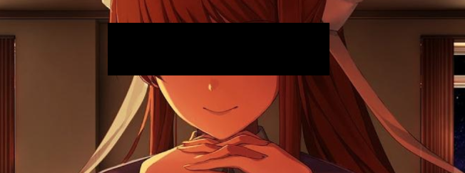
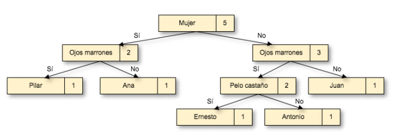

# giw-monika


## Introducción

***“Guess who?”***, es un juego de adivinanzas para dos jugadores, concebido y fabricado por primera vez por [Milton Bradley](https://es.wikipedia.org/wiki/Milton_Bradley_Company) en los años 80 y actualmente fabricado y distribuido por [Hasbro](https://es.wikipedia.org/wiki/Hasbro). En este juego, cada jugador dispone de un tablero idéntico que contiene 24 dibujos de personajes identificados por su nombre. El juego empieza al seleccionar cada jugador una carta al azar de una pila separada de cartas, que contiene las mismas 24 imágenes. El objetivo del juego consiste en ser el primero en determinar qué carta seleccionó el oponente. Esto se consigue haciendo preguntas, una por turno, cuya respuesta puede ser sí o no, para eliminar candidatos. Un ejemplo de pregunta es *«¿Tu personaje tiene bigote?»*. La respuesta de nuestro oponente nos permitirá eliminar los personajes que no cumplan el criterio, tumbando estas tarjetas del tablero.

Este proyecto utiliza un TDA Árbol Binario (TDA bintree) para implementar un jugador automático para este juego. En este caso, se le ha dado el nombre de **Monika**. Ella será la encargada de hacernos las preguntas y quien encontrará al personaje en el que hemos pensado en un principio.

## Definición del tablero de personajes

Para poder jugar al juego primero definimos un tablero de personajes utilizando un formato de texto plano que se indica a continuación. 

*Atributo1 \t Atributo2 \t … \t AtributoK \t Nombrepersonaje \n* 

*v11 \t v12 \t … \t v1k p1 \n* 

*v21 \t v22 \t … \t v2k p2 \n … vN1 \t vN2 \t … \t vNk pN \n* 

Este fichero define un tablero de N personajes y k atributos diferentes, donde vij toma un valor en {0, 1} (0=“No”, 1= “Si”), indicando si el personaje i , de nombre pi , presenta o no el atributo j. El número máximo de personajes que pueden definirse con K atributos binarios es 2 k . Para que un tablero sea válido, es obligatorio que dos personajes distintos tengan, al menos, un atributo distinto. Por ejemplo, el siguiente tablero (Tablero 1) define 5 personajes diferentes utilizando 4 atributos (N=5, k=4): 

| Mujer | Ojos Marrones | Pelo castaño | Tiene gafas | Nombre personaje |
|-------|---------------|--------------|-------------|------------------|
| 0     | 1             | 1            | 1           | Ernesto          |
| 1     | 0             | 0            | 0           | Ana              |
| 0     | 0             | 1            | 1           | Juan             |
| 0     | 1             | 0            | 0           | Antonio          |
| 1     | 1             | 1            | 0           | Pilar            |

Este fichero con la definición del tablero de personajes debe ser conocido por parte del jugador humano y del jugador automático, ya que el juego se desarrollará partiendo de esta descripción de personajes.

## Creación de Monika

Para implementar al jugador automáticos, se han creado la respectiva clase. Todo el código está accesible en este repositorio. Dicho jugador ha de tener información sobre 1) los personajes del tableto, 2) los atributos de dichos personajes (nunca habrá personajes son los mismos atributos), 3) el tablero, 4) el arbol de preguntas y 5) el nodo donde se encuentra. 

* **Lectura del tablero.** La lectura de los ficheros de tablero (como el representado en la tabla del apartado anterior) carga los datos del tablero en las variables tablero, personajes y atributos del objeto de clase QuienEsQuien. Puede consultar su especificación e implementación en los ficheros quienesquien.h y quienesquien.cpp. 

* **Representación de las preguntas para adivinar todos los personajes del tablero.** Se ha construido un árbol binario para representar la sucesión de preguntas necesarias para adivinar cada personaje del tablero. Este árbol binario se almacena en el atributo árbol en la clase del personaje. Para ello, el campo etiqueta de cada nodo n de este árbol almacenará elementos de tipo Pregunta. El nodo raíz del árbol codifica la primera pregunta que formula el jugador automático. Los nodos hijos del nodo raíz (nodos de nivel 2) representan la segunda pregunta que formula el jugador automático, y así sucesivamente. 

  

  

  Esta figura muestra un esquema de esta representación aplicada al Tablero de la tabla del principio. El árbol se ha construido formulando preguntas sobre los atributos de dicho tablero según el orden en el que vienen dados en el fichero. Cada nodo n del árbol codifica una pregunta asociada al juego y el número de personajes que aún no han sido eliminados. El hijo izquierda de n representa el tablero de personajes que tienen respuesta “Si” a la pregunta formulada en n, y el hijo derecha el tablero de personajes que se obtiene con la respuesta “No” a la pregunta. Los nodos hoja del árbol codifican un tablero en el que sólo queda un personaje que no ha sido descartado. En este caso, el campo atributo debe contener el nombre del personaje en cuestión y el campo num_personajes es igual a 1. Por tanto, el camino desde la raíz del árbol hasta n determina la sucesión de preguntas y respuestas obtenidas hasta llegar a ese tablero, y los nodos hoja descendientes de n determinan los personajes aún no tumbados en el tablero asociado a n. 

## Desarrollo de la partida 

Una vez construido este árbol con sucesiones de preguntas para identificar cada personaje, una partida del juego se implementa como un recorrido por este árbol, comenzando desde la raíz y hasta alcanzar un nodo hoja. De este modo, durante el transcurso de la partida, será necesario registrar por cuál nodo del árbol va la partida. Al inicio de la partida, jugada_actual se inicializa con el nodo raíz del árbol. Monika formulará la pregunta asociada al este nodo, y la respuesta del usuario determina el camino a seguir (Sí = hijo izquierda, No= hijo derecha). Este proceso se continúa hasta que jugada_actual alcanza un nodo hoja. En ese momento, el jugador automático ya conoce la respuesta, y lo imprimirá por pantalla con el nombre del personaje almacenado en la etiqueta del nodo hoja. Con esto acaba la partida, jugada_actual se reinicia al nodo raíz del árbol y se da al usuario la opción de jugar otra vez. 

## Material

En este repositorio se ofrece el siguiente material:

* Todo el código fuente de la aplicación.

  * Para la generación de la documentación del código fuente, se puede generar mediante doxygen, para ello basta con acompañar el comando

    ```
    make documentacion
    ```

* Varios tableros con distintos números de personajes.